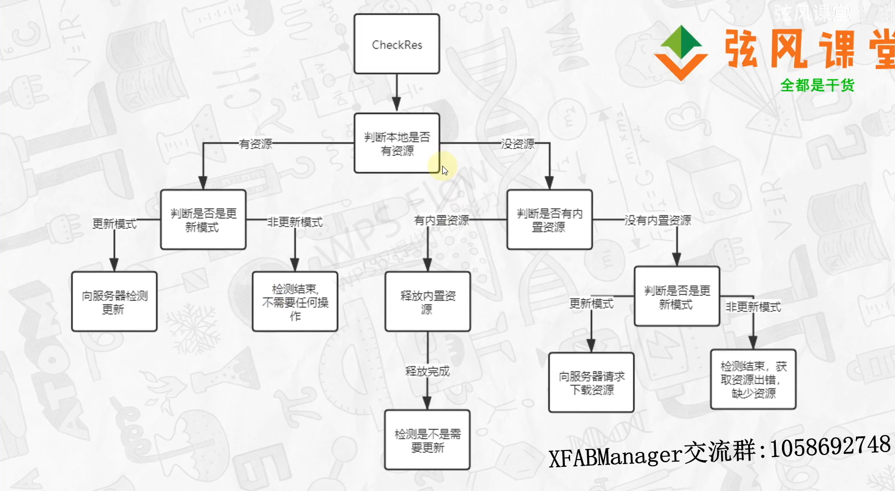
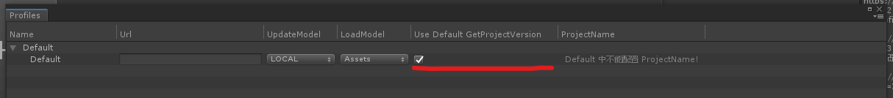

## XFABManager教程

### GUI界面教程 

1. Project窗口介绍
		请参考视频: https://www.bilibili.com/video/BV1LX4y1P7AC?p=2
2. Profile 和 Tools介绍
		请参考视频: https://www.bilibili.com/video/BV1LX4y1P7AC?p=3
3. 多配置功能
		请参考视频: https://www.bilibili.com/video/BV1uX4y1w7M9?p=3

### 准备AssetBundle文件

1. 在加载资源之前需要准备好AssetBundle的文件，AssetBundle文件的来源可以从服务端下载，也可以内置到安装包中.
   大家可以根据自己的需求来选择不同的方式，具体的配置可以参考上面的 GUI界面教程 中的 2 , 3 !
   
### 检测更新资源 

1. 在准备AssetBundle资源之前，我们需要知道准备的方式( 从服务端下载 还是从安装包中释放,需不需要更新 等等 )   
   我们可以通过 AssetBundleManager.CheckResUpdate("projectName") 这个方法来进行检测某一个模块的资源要做什么样的操作?
   具体如下:
	
	IEnumerator Start()
    {
        CheckResUpdateRequest requestCheck = AssetBundleManager.CheckResUpdate("projectName");
        yield return requestCheck;

        Debug.Log(requestCheck.result);

        if (!string.IsNullOrEmpty(requestCheck.error))
        {
            // 检测失败 
            Debug.Log(requestCheck.error);
        }
        else {
            // 检测成功
            Debug.LogFormat("CheckUpdateResult:{0}", requestCheck.result);
			// 更新类型 
            Debug.LogFormat("updateType:{0}", requestCheck.result.updateType);  // 具体含义可以查看UpdateType注释
        }
    }
	
	检测更新的逻辑如下图:
		

	视频讲解: https://www.bilibili.com/video/BV1LX4y1P7AC?p=5
	
	*注:检测更新的时候需要获取项目版本号,默认的项目版本号的配置请参考视频: https://www.bilibili.com/video/BV1LX4y1P7AC?p=4
	
### 更新或下载资源 

1. 如果某一个模块检测的结果的更新类型是 : UpdateType.Update 或者 UpdateType.Download 或者 UpdateType.DownloadZip
   这个时候我们可以通过方法 AssetBundleManager.UpdateOrDownloadRes("Test1"); 来做更新或下载的操作! 具体如下:
		
		IEnumerator Start()
		{
			UpdateOrDownloadResRequest request = AssetBundleManager.UpdateOrDownloadRes("Test1");

			while (!request.isDone)
			{
				yield return null;
				// 更新信息
				Debug.Log( " 下载进度: " + request.progress);
			}

			if (string.IsNullOrEmpty(request.error))
			{
				Debug.Log("下载完成!");
			}
			else {
				Debug.LogFormat("下载出错:{0}",request.error);
			}

		}
	
	AssetBundleManager.UpdateOrDownloadRes(string projectName);		  // 先做检测资源的逻辑 根据结果进行处理
	AssetBundleManager.UpdateOrDownloadRes(CheckUpdateResult result); // 直接根据检测的结果处理
	
	*注：如果检测的结果非上诉三种类型，调用此方法将不会做任何操作!
	
	视频讲解: https://www.bilibili.com/video/BV1LX4y1P7AC?p=4
	
### 释放资源

1.	如果我们把资源内置到安装包中, 在使用之前需要把内置的资源复制到数据目录;( Application.streamingAssetsPath -> Application.persistentDataPath )
	这个复制的过程我们把它叫做释放,释放资源代码如下:
	
			IEnumerator Start()
			{
				ExtractResRequest request = AssetBundleManager.ExtractRes("Test1");

				while (!request.isDone)
				{
					yield return null;
					Debug.Log(" 释放进度: " + request.progress );
				}

				if (string.IsNullOrEmpty(request.error))
				{
					Debug.Log("释放完成");
				}
				else {
					Debug.LogFormat("释放出错:{0}" , request.error);
				}

			}
	
	AssetBundleManager.ExtractRes(string projectName);		 // 先做检测资源的逻辑 根据结果进行处理
	AssetBundleManager.ExtractRes(CheckUpdateResult result); // 直接根据检测的结果处理
	
	*注:同样的，如果检测的结果不是UpdateType.ExtractLocal，调用此方法将不会做任何操作!
	
	视频讲解:	https://www.bilibili.com/video/BV1LX4y1P7AC?p=6
	
### 准备资源

1.	一个项目的资源具体要做什么样的处理, 是释放,还是更新或者先释放再更新? 都是有可能的, 并且他的逻辑都是固定的,
	所以这里我提供了一个准备资源的方法( AssetBundleManager.ReadyRes("Test1") ), 当这个方法执行完成的时候,就代表
	我们已经把这个模块的资源准备完成了,可以进行使用了, 我们不需要关心他是更新的还是释放的还是解压的 等等.
	实例代码如下:
			
			IEnumerator Start()
			{
				ReadyResRequest request = AssetBundleManager.ReadyRes("Test1");

				while (!request.isDone)
				{
					yield return null;
					Debug.LogFormat(" project:{0} updateType:{1} progress:{2}", request.currentProjectName, request.updateType, request.progress);
				}

				if (string.IsNullOrEmpty(request.error))
				{
					Debug.Log("资源准备成功!");
				}
				else {
					ebug.LogErrorFormat("资源准备失败:{0}", request.error);
				}
			}
	
	*注:如果需要自定义准备资源的逻辑,可以通过本插件提供的方法自己编写，具体可以参考 [XFABManager API](Assets/XFABManager/Doc/XFABManager_API.md)：API文档 !
	
	视频讲解:	https://www.bilibili.com/video/BV1LX4y1P7AC?p=7
	
### 加载资源

	当准备完AssetBundle文件之后,就可以加载这个模块的资源了,我们不需要关心AssetBundle的加载,这一步插件会替我们处理,
	我们可以直接使用加载资源的方法,来拿到我们想要的资源!
	
1.	从AssetBundle的文件中同步加载资源:
		
		// 参数分别为 projectName(资源模块名称) ,  bundleName(资源所在的bundle名称)  , assetName(资源名) 
		GameObject cubePre = AssetBundleManager.LoadAsset<GameObject>("Test1", "bundle1", "Cube" );
	
2.	从AssetBundle的文件中异步加载资源:
		
		IEnumerator Start()
		{

			LoadAssetRequest request = AssetBundleManager.LoadAssetAsync<GameObject>("Test1", "bundle1", "Cube");
			yield return request;

			if (string.IsNullOrEmpty(request.error))
			{
				GameObject prefab = request.asset as GameObject;
				GameObject.Instantiate(prefab);
			}
			else {
				Debug.LogFormat("资源加载失败:{0}",request.error);
			}

		}
	
3.	除此之外还有一些其他的加载资源的方法,比如:
		
		AssetBundleManager.LoadAllAssets<GameObject>("projectName", "bundleName");
        AssetBundleManager.LoadAssetWithSubAssets<GameObject>("projectName", "bundleName", "assetName");
        AssetBundleManager.LoadScene("Test1", "scenes", "TestLoadScene", UnityEngine.SceneManagement.LoadSceneMode.Single);
        ...
		
	他们的用法跟上面都是一样的,具体含义可以参考  [XFABManager API](Assets/XFABManager/Doc/XFABManager_API.md)：API文档 ！
	
	视频讲解:	https://www.bilibili.com/video/BV1LX4y1P7AC?p=8
	
### 卸载资源

1.	卸载某一个模块的某一个AssetBundle,代码如下:
		
		// 此方法只会卸载指定的这个AssetBundle,并不会卸载其依赖的AssetBundle, ( 后面会考虑添加依赖的AssetBundle的引用计数功能,来对依赖的AssetBundle进行及时清理 )
		AssetBundleManager.UnLoadAssetBundle("projectName", "bundleName");
		
2.	卸载某一个模块的所有AssetBundle
	
		
		AssetBundleManager.UnLoadAllAssetBundles("projectName");
	
	视频讲解:	https://www.bilibili.com/video/BV1LX4y1P7AC?p=9
	
### 自定义获取项目版本

1.	插件中提供了一种获取项目版本号的功能,也就是默认的获取方式,但是这种方式可能不能适用于所有的项目,
	所以提供了自定义获取项目版本号的接口,如果需要自定义项目的版本号获取方式,具体操作如下:
		
		1.1	首先需要禁用默认的获取方式,取消勾选下图的复选框即可,
		

			
		1.2	然后创建一个脚本,实现接口 IGetProjectVersion , 重写下面的四个方法:
			
			void GetProjectVersion(string projectName );	//	获取项目版本信息  

			bool isDone();									//	判断是否获取完成  如果已完成 返回 true , 未完成返回 false 
			
			string Result();								//	成功获取到版本号之后, 把版本号的值通过这个方法返回回去!
			
			string Error();									//	如果获取版本号出错了 把报错信息返回回去, 如果没报错返回 string.Empy !
			
		1.3 把自定义的脚本类型设置给AssetBundleManager
			
			AssetBundleManager.SetGetProjectVersion<T>() where T : IGetProjectVersion
			
			AssetBundleManager.SetGetProjectVersion(Type type)
			
			AssetBundleManager.SetGetProjectVersion(IGetProjectVersion getProjectVersion) // 改方法已经过时,将会在未来的版本中移除,请使用上面的两个方法
			

### 如有疑问 或 遗漏请及时联系群主,qq交流群:1058692748